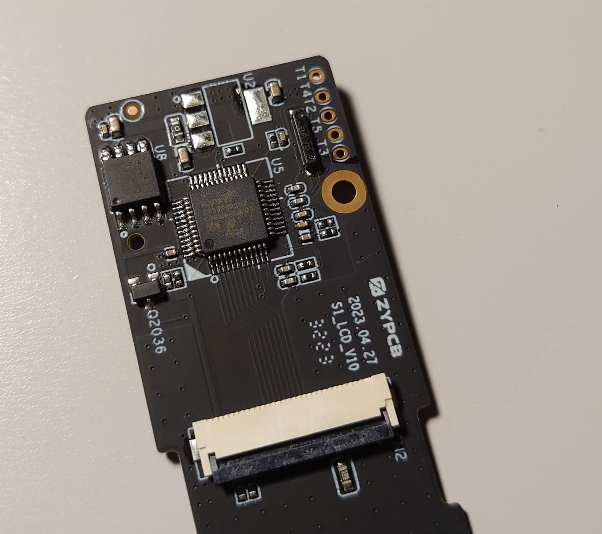
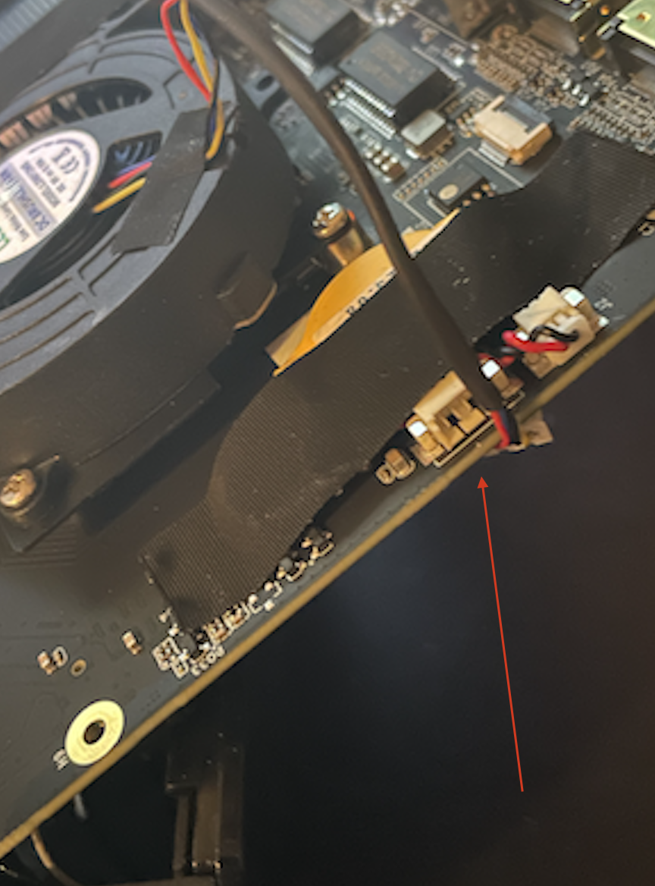
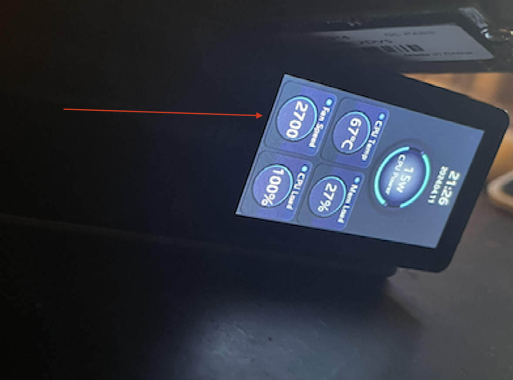
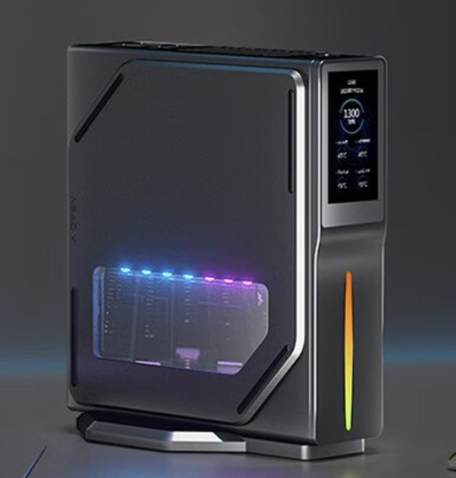
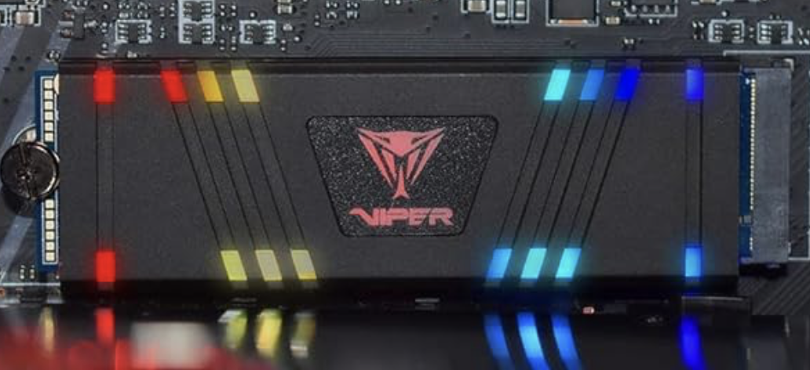
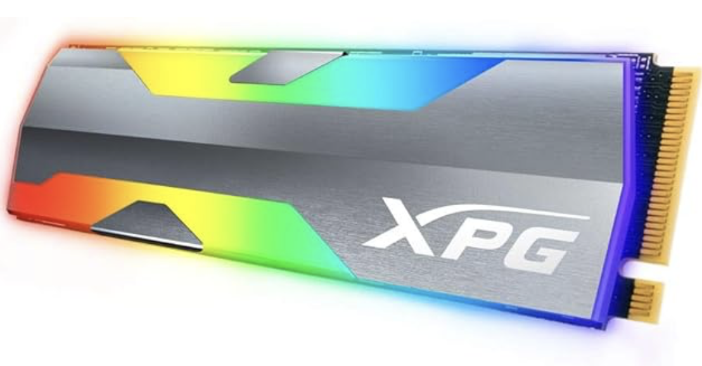

# AceMagic-S1-LED-TFT-Linux
ACEMAGIC S1 Mini LCD/LED Control for Linux

# First: My Rant

While this mini PC offers impressive features, the absence of information regarding the TFT front screen and LED strip is frustrating. Despite being advertised as 'with DIY LCD Display' on Amazon, the lack of Linux support is disappointing. My objective is to enable control of these components in Linux, facilitating integration with projects like Batocera.linux. 

I don't really trust reviews from people who received gadgets for free in exchange for a review. Getting free stuff can definitely cloud judgment. Seriously, I found more insightful reviews for ancient computers like the Apple IIe and Commodore 64 (and those things haven't been made in decades!) Something is lost when everyone tries to make a career out of YouTube videos. So, after wading through over 30 reviews, I present you with 3 that I'll call: the good, the bad, and the cute.

 - [@Robtech](https://youtu.be/6UT2CNC_NKw)
 - [@NovaspiritTech](https://youtu.be/gnL6fkKT9B4)
 - [@MKV2020](https://youtu.be/nJE3rzMHo80)

> [!WARNING]
> This git page may contain trace amounts of sarcasm. Do not operate heavy machinery or attempt brain surgery after reading. My opinion is worth about as much as a free fortune cookie (but hopefully less confusing).

> [!TIP]
> If techie stuff makes your eyes glaze over, feel free to jump straight into the fun part with the [s1panel](s1panel/README.md) app!

## LED Strip

The LED strip from what I gather is controlled by the USB-SERIAL CH340.


## TFT-LCD Display

The TFT-LCD display is controlled via the USB HID device. the control board has a Holtek HT32 chip on it. There is some firmware doing the drawing. 


    DeviceClass             : HIDCLASS
    DeviceID                : HID\VID_04D9&PID_FD01&MI_00\7&3A7B026B&0&0000
    DeviceName              : HID-compliant consumer control device
    HardWareID              : HID\VID_04D9&PID_FD01&REV_0110&MI_00

    DeviceClass             : HIDCLASS
    DeviceID                : HID\VID_04D9&PID_FD01&MI_01\7&16A3C4A9&0&0000
    DeviceName              : HID-compliant vendor-defined device
    HardWareID              : HID\VID_04D9&PID_FD01&REV_0110&MI_01

the HT32 control board:




as you can see in the photo below, the sample traffic sent to the device:


## commands for TFT screen

all commands have an 8 byte header. total buffer sent is always 4104 bytes, that is 8 bytes for header, and 4096 for data. the header always starts with a signature byte (0x55), followed by command byte and a sub command byte. 

#### set_orientation (0xA1 0xF1)

```c++
struct set_orientation {
    uint8_t header;      // 0x55
    uint8_t command1;    // 0xA1
    uint8_t command2;    // 0xF1 = set orientation
    uint8_t orientation; // 0x01 = landscape, 0x02 = portrait
    uint8_t unused[4];
};
```

data look like this:
```
55 a1 f1 02 00 00 00
```

the "Disconnection, content information display will not be allowed!" will show correct orientation

#### set_time (0xA1 0xF2)

this is used to keep the internal clock updated and as a heartbeat..

```c++
struct set_time {
    uint8_t header;   // 0x55
    uint8_t command1; // 0xA1
    uint8_t command2; // 0xF2 (heartbeat) or 0xF3 (set time) 
    uint8_t hour;     // 0x0E = 14 hours (2pm)
    uint8_t minute;   // 0x1C = 28 minutes
    uint8_t second;   // 0x2D = 45 seconds
    uint8_t unused[2];
};
```

data looks like this:
```
55 a1 f2 0e 1c 2d 00 00    2:28:45
55 a1 f2 0e 1c 2e 00 00    2:28:46
```
 
#### redraw (0xA3)

bitblt the entire screen

```c++
struct lcd_redraw {
    uint8_t header;   // 0x55
    uint8_t command1; // 0xA3
    uint8_t command2; // 0xF0 = start, 0xF1 = continue, 0xF2 = end
    uint8_t sequence; // 0x01 - 0x1B
    uint16_t offset;  // 
    uint16_t length;  //
};
```

data looks like this (image data omited):

```
    0  1  2  3  4  5  6  7    offset - length
   55 a3 f0 01 00 00 00 10         0 - 4096      
   55 a3 f1 02 00 10 00 10      4096 - 4096      
   55 a3 f1 03 00 20 00 10      8192 - 4096            
   55 a3 f1 04 00 30 00 10     
   55 a3 f1 05 00 40 00 10     
   55 a3 f1 06 00 50 00 10     
   55 a3 f1 07 00 60 00 10     
   55 a3 f1 08 00 70 00 10     
   55 a3 f1 09 00 80 00 10     
   55 a3 f1 0a 00 90 00 10     
   55 a3 f1 0b 00 a0 00 10     
   55 a3 f1 0c 00 b0 00 10     
   55 a3 f1 0d 00 c0 00 10      
   55 a3 f1 0f 00 e0 00 10      
   55 a3 f1 10 00 f0 00 10     
   55 a3 f1 11 00 00 00 10   (see warning below)  
   55 a3 f1 12 00 10 00 10     
   55 a3 f1 13 00 20 00 10     
   55 a3 f1 14 00 30 00 10     
   55 a3 f1 15 00 40 00 10     
   55 a3 f1 16 00 50 00 10     
   55 a3 f1 17 00 60 00 10     
   55 a3 f1 18 00 70 00 10     
   55 a3 f1 19 00 80 00 10     
   55 a3 f1 1a 00 90 00 10     
   55 a3 f2 1b 00 a0 00 09    40960 - 2304
```

> [!WARNING]
> The offset field is ignored since it wraps around back to 0 at sequence 0x11. I am assuming the firmware will use the sequence to figure out the offset. 

#### update (0xA2)

bitblt portion of the framebuffer at x,y coordinates. this will send small image data to update, this data can be anything. because the framebuffer is slow, this is used to update portions of the framebuffer quickly.

```c++
struct lcd_update {
    uint8_t header;   // 0x55
    uint8_t command;  // 0xA2
    uint16_t x;       // 0x0012 x=18
    uint16_t y;       // 0x0032 y=50
    uint8_t width;    // 0x18 w=24
    uint8_t height;   // 0x0C h=12
};
```

data looks like this (image data omited):

```
55 a2 12 00 32 00 18 0c 
55 a2 12 00 26 00 18 0c 
55 a2 12 00 18 00 18 0c 
55 a2 12 00 0a 00 18 0c
```

> [!NOTE]
> You can set any size update region (up to 254 width, and 170 height) as long as the pixel data does not exceed the total size of the 4096 buffer limit. for example, w=51, h=40 (51 x 40 x 2 = 4080 bytes) or w=102, h=20 (102 x 20 x 2 = 4080). there is a fine balance between how big each update region is vs how fast you need the area updated. The max update region size are 254 x 4 and 12 x 170.

> [!TIP]
> You can find the js code for the LCD [here](s1panel/lcd_device.js).

## Image Data

the screen is a 320 x 170 x 2 (16-bit color) framebuffer. the 0,0 is upper right when in portrait orientation, or upper left when in landscape. the pixel format is RGB565. had to do an endian swap when setting the pixel.

```c++

#define RGB565(r, g, b) (((r & 0x1F) << 11) | ((g & 0x3F) << 5) | (b & 0x1F))
#define SWAPENDIAN(num) (num>>8) | (num<<8);

color = RGB565(red, green, blue);
*pixel = SWAPENDIAN(color);

```

here is an example cycle through red, green, blue, and a color gradient. sorry about the quality, it looks much better in person.


here is the code for the above:

```c++
const int width = 320;
const int height = 170;

unsigned char *framebuffer =  (unsigned char *)calloc(width * height, 2);

for (int i = 0; i < 5; i++) {

    unsigned char* ptr = framebuffer;

    for (int y = 0; y < height; y++) {

        for (int x = 0; x < width; x++) {

            uint16_t* pixel = (uint16_t*)ptr;
            uint16_t color = 0;

            switch (i) {

                case 0:  // black, clear the screen
                    break;

                case 1:  // red
                    {
                        uint8_t intensity = (uint8_t)((y * 31) / (height - 1));
                        color = RGB565(intensity, 0, 0);
                    }
                    break;
                case 2: // green
                    {
                        uint8_t intensity = (uint8_t)((y * 63) / (height - 1));
                        color = RGB565(0, intensity, 0);
                    }
                    break;
                case 3: // blue
                    {
                        uint8_t intensity = (uint8_t)((y * 31) / (height - 1));
                        color = RGB565(0, 0, intensity);
                    }
                    break;
                case 4: // gradient
                    {
                        uint8_t red_intensity = (uint8_t)((x * 31) / (width - 1));
                        uint8_t green_intensity = (uint8_t)((y * 63) / (height - 1));
                        uint8_t blue_intesity = (uint8_t)(((width - x - 1) * 31) / (width - 1));
                        color = RGB565(red_intensity, green_intensity, blue_intesity);
                    }
                    break;
            }

            *pixel = SWAPENDIAN(color);
            ptr += 2;
        }
    }

    if (-1 == set_image(handle)) {
        break;
    }

    std::this_thread::sleep_for(std::chrono::milliseconds(1000));
}
```

update function at work:


With the update function, Some cool animations can be done. Although I did notice that after a few cycles, the screen starts to slow down a bit. It seems like there might be an issue with the firmware. My guess is that it was designed to handle a few updates and then take a quick nap for about a second. So, bursts of updates followed by short breaks seem to keep this device happy. But hey, even with that, you can still create some neat stuff, like an analog watch face or even small bursts of animation.

> [!NOTE] 
> UPDATE: I noticed when you send the set_time/heartbeat too often it will slow down. if i leave the heartbeat to hit every 1 second, and send the screen updates every 10ms, the animation is much smoother. still have to sleep a little between updates, otherwise you will get a send error.


## Commands for LED strip

the LED strip uses a 5 byte buffer, with a signature 0xfa followed by theme, intensity, speed and a checksum. you open the device like a regular serial port and write bytes to it.

```c++
struct led_command {
    uint8_t signature; // 0xfa
    uint8_t theme;     
    uint8_t intensity;
    uint8_t speed; 
    uint8_t checksum;
};
```
#### theme
```
0x01 = rainbow
0x02 = breathing
0x03 = color cycle
0x04 = off
0x05 = automatic
```
#### intensity
```
0x01 = level 5
0x02 = level 4
0x03 = level 3
0x04 = level 2
0x05 = level 1
```
#### speed
```
0x01 = level 5
0x02 = level 4
0x03 = level 3
0x04 = level 2
0x05 = level 1
```
#### checksum

```
crc = LSB(signature + theme + intensity + speed)
```

turning off the LED strip you will need to send the intesity and speed too. 

> [!TIP]
> You can find the js code for the LED [here](s1panel/led_device.js).

## Flow

- set_orientation
- set_time
- heartbeat
- redraw
- heartbeat
- update
- heartbeat
- update
- update
- heartbeat
etc...

## Putting it all together

I finaly received my 1TB WD_BLACK Gen4 NVME and installed the latest ubuntu 23.10, so I can try playing around with this using node.js. I am able to connect using [node-hid](https://github.com/node-hid/node-hid) and use the [node-canvas](https://github.com/Automattic/node-canvas) to draw and write text. I'm also looking at [chartjs-node-canvas](https://github.com/SeanSobey/ChartjsNodeCanvas) for the graphs.

```javascript

const node_hid = require('node-hid');
const node_canvas = require('canvas');

node_hid.setDriverType('libusb');

node_hid.HIDAsync.open('1-8:1.1').then(handle => {

    const width = 320;
    const height = 170;
    const canvas = node_canvas.createCanvas(width, height);
    const ctx = canvas.getContext('2d', { pixelFormat: 'RGB16_565' });

    lcd_redraw(handle, ctx.getImageData(0, 0, width, height));
});
```

Here is a sample of 7pt to 24pt Arial font:


> [!TIP]
> See the [s1panel](s1panel/README.md) for source/app to control the LCD/LED.


as for the sensors on this S1, using the lm_sensors it only discovers the coretemp:

```terminal
# sensors
nvme-pci-0100
Adapter: PCI adapter
Composite:    +49.9°C  (low  = -40.1°C, high = +83.8°C)
                       (crit = +87.8°C)
Sensor 1:     +70.8°C  (low  = -273.1°C, high = +65261.8°C)
Sensor 2:     +45.9°C  (low  = -273.1°C, high = +65261.8°C)

coretemp-isa-0000
Adapter: ISA adapter
Package id 0:  +44.0°C  (high = +105.0°C, crit = +105.0°C)
Core 0:        +42.0°C  (high = +105.0°C, crit = +105.0°C)
Core 1:        +42.0°C  (high = +105.0°C, crit = +105.0°C)
Core 2:        +42.0°C  (high = +105.0°C, crit = +105.0°C)
Core 3:        +42.0°C  (high = +105.0°C, crit = +105.0°C)
```

### UPDATE 2024-4-11 on the FAN speed: 

Upon opening my S1 mini to locate the fan's connection point, I unplugged it to trace the wires. To my surprise, the fan speed indicator remained at 1000. Curiously, I stress-tested the CPU, and despite the fan being off and disconnected, the fan RPM increased. This experience solidifies my belief that the fan speed indication is <strong>BS</strong>. Quite disappointing, indeed.

<div>


</div>

### Final Thoughts

This mini PC is manufactured and sold by Shenzhen CYX Industrial Co., Ltd., but OEMed by Acemagic. You can find N95 models on Alibaba and similar marketplaces for as little as $100 (with a minimum order quantity of 50), and you can even get your name slapped on the side of it. However, I purchased my three units on Amazon for around $230 each. Although mine are the N97 models, I'm sure Acemagic still managed to turn a decent profit on these. Overall, I like this machine! the N97 is a low power mobile processor, and for a retro gaming and development it is pretty decent. What I don't understand is why they invested so much in developing the front screen LCD and even gave us control over the LED strip, yet they couldn't figure out how to connect the FAN so we can read the RPMs. 

#### Advantages
1. Love that you can stand it up. takes less space on desk.
2. The front LCD screen can display what ever you want.  

#### Disadvantages
1. LCD screen needs more functionality, like the ability to turn it off (like you can with the LED strip)
2. Ability to read the Cooling FAN speed is missing. 


## Addendum

You ever wondered what that little window on the side is for? The original image released for S1 actually showed RGB lights through it:



You can actually buy an SSD with RGB lights, and I was able to find a couple of manufacturers that make these:

<div>


</div>
<br>

  - Patriot Memory Viper VPR400 RGB PCIe SSD 
  - XPG SPECTRIX RGB PCIe SSD
  - Addlink Addgame X70 2TB PCIe SSD

I haven't tested the above, nor do I endorse them, but if you really want to pimp your S1 out, any gaming SSD with RGB lights should work (up to Gen 4 - NVMe M.2 2280) :smile:


## Additional Documentation and Acknowledgments

* WireShark
* IDA
* [Application Notes for AN0619](https://www.holtek.com/page/applicationNotes/AN0619)
* [ESK32-A2A31_UserManual v100 pdf](https://www.holtek.com/WebAPI/187541/ESK32-A2A31_UserManualv100.pdf/c8975661-c04f-4b33-8cc2-dc2e5aa3026c)
* [ESK32-A2A31 Dev Kit](https://www.holtek.com/page/detail/dev_kit/ESK32-A2A31)


