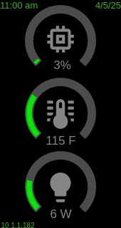
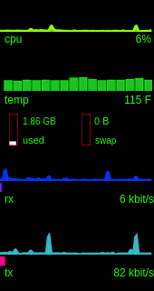
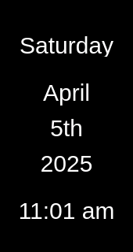

# s1panel

This is my attempt at a panel software for linux, specifically for the ACEMAGIC S1 Mini PC with LCD Screen running Ubuntu 23.10 Desktop.

> [!NOTE]
> I am not affiliated with acemagic or minipcunion, nor have I been paid for any of this work. It's all done as a hobby (or a solution to a problem I had).  The software is provided as-is, without any warranties or guarantees of any kind, expressed or implied. Usage of the s1panel project is at your own risk. s1panel is an open-source project and is distributed under the GPL-3.0 license.  

## Release Notes

#### 2024-04-09
  - added the widget position change buttons (up, down, top, bottom)
  - fixed clock sensor's 12-hr format showed 0 at midnight

#### 2924-04-10
  - Fixed screen sensor polling when on rotation
  - Fixed calendar sensor and added more tokens
  - Added network sensor
  - Added bar_chart widget
  - Added 2 more screens on rotation to demo theme

## Dependencies

Until I do an official release and figure out how to package all this, you will need to follow the below steps. You should at least have minimal version of node+npm installed. 

```
sudo apt install nodejs
sudo apt install npm
```

```
$ node -v
v18.13.0
$ npm -v
9.2.0
```

## Upgrade

stop the service, do a git pull, update any npm packages, build the gui, start service.

```
sudo service stop s1panel
git pull
npm i
cd gui
npm i
npm run build
sudo service start s1panel
```

> [!WARNING]
> make sure you backup your config.json and themes/simple_demo/ directory before upgrading or you will loose your changes!

## New Install

clone this repo

```
git clone https://github.com/tjaworski/AceMagic-S1-LED-TFT-Linux.git acemagic
```

install this as a service

```
cd acemagic/s1panel
sudo ./install
```

also make sure you have lm_sensors installed and configured for the cpu temp to work.

```
sensors
coretemp-isa-0000
Adapter: ISA adapter
Package id 0:  +45.0°C  (high = +105.0°C, crit = +105.0°C)
Core 0:        +42.0°C  (high = +105.0°C, crit = +105.0°C)
Core 1:        +42.0°C  (high = +105.0°C, crit = +105.0°C)
Core 2:        +42.0°C  (high = +105.0°C, crit = +105.0°C)
Core 3:        +42.0°C  (high = +105.0°C, crit = +105.0°C)
```

open your browser to the gui page http://localhost:8686

> [!IMPORTANT]
> if you want to access the gui remotely you will need to change the listen address in config.json to 0.0.0.0:8686 and restart the service.

### top panel

this shows you the preview screen, and the settings which can be found in config.json file.


### bottom panel

this is the theme configuration screen where you can add, remove and change the panel components.


### widgets

expanding each widget shows you the configuration for that widget


## Work in Progress

Things i still need to work on are theme management, more widgets and sensors. I'm still trying to find the fan speed. but with all this you can roll your own widgets and sensors. I will be creating a more detail wiki on how all this works in the coming weeks.

if you make changes to config.json or the theme.json manually make sure you restart the service.

## Quick "How does it work"

Each theme consists of one or more screens, each of which contains one or multiple widgets. A widget is an element responsible for rendering content on the screen, while a sensor gathers data for the widgets to utilize. Themes may feature multiple screens set on a rotation schedule, with specified durations for display before transitioning to the next screen. When rendering widgets it's essential to ensure correct z-ordering in the cases of overlapping widgets. Everything is always sorted on the 'id' field (ascending order). You have the option to either always perform a full-screen redraw or update only the widget region. Using the screen wallpaper or image widget, please make sure you have the correct sizes, I do not perform any resizing of the images. Regardless of the orientation, the wallpaper is always 320x170. The image widget will rotate the image depending on the orientation. PNG transparency is supported. The LED strip configuration is associated with each screen individually, allowing for a unique LED theme to be displayed alongside the current screen.

current sensors are:

     calendar, clock, cpu_power, cpu_temp, cpu_usage 

current widgets are:

     custom_bar, doughnut_chart, image, line_chart, text

Each sensor will return data based on a format token. For example, when setting the clock, the format field with {0} will return the 24-hour time, while {1} will return the 12-hour time. Additionally, you can add {3} for AM/PM. So, having the format "The current time is {1} {3}" will display "The current time is 12:00 pm". To determine the available tokens, please review the details within each sensor. I'm currently developing new sensors and widgets, including the elusive fan speed sensor, a ping sensor, and several new widgets such as animated PNG (APNG), and a slideshow PNG. I'm also experimenting with a widget featuring a walking bug on the screen :) Another feature I'd like to add is a 'night mode', which clears the screen and sets the background color to black. I have the S1 on my desk, and it can be quite bright at night. I wish the acemagic guys had included a firmware functionality/command to control the LCD screen on and off.

#### demo theme has 3 screens on 1 minute rotation

<div>



</div>
 


> [!TIP]
> Please share photos of your creations with me, and I'll feature them here. I'm genuinely excited and can't wait to see what you all come up with! I created a subreddit here https://www.reddit.com/r/s1panel/
